# 智能计算系统 Lab6：模型推理优化实验报告

|  |  |
|:--|:--|
| **实验名称** | Lab6：模型推理优化——卷积算子全流程优化 |
| **实验目标** | 基于 ResNet-18 探索卷积算子的 FP32/FP16 Implicit GEMM 优化与 Tensor Core 加速 |
| **提交日期** | 2026-05-22 |

> **图片路径说明**：报告中所有图片均位于 `docs/figures/` 目录

---

## 摘要

卷积神经网络中 Conv2d 算子的计算效率直接制约模型推理吞吐量。本实验以 ResNet-18 / CIFAR-10 为基准，逐步实现四种 CUDA 卷积算子：直接卷积（Baseline FP32）、Implicit GEMM FP32、Implicit GEMM FP16 以及 Tensor Core（WMMA）Implicit GEMM。所有算子均通过 pybind11 集成到 PyTorch 自定义算子框架。在 NVIDIA GeForce RTX 4060 Laptop GPU（CUDA 12.9，架构 sm\_89）上的实测表明：全部算子推理精度均达到 96.00%，远超 ≥90% 的作业要求；在 BatchSize = 256 时，FP16 Implicit GEMM 实现最高 **3.45×** 吞吐量增益；在 BatchSize = 8 时，WMMA Tensor Core 实现 **2.52×** 增益。进阶测评表明，Tensor Core 对 2048×2048 FP16 GEMM 的加速比达 **35.0×**。本报告完整记录了实现方案、关键设计决策、调试过程与实测数据。

---

## 目录

1. [实验背景与目标](#1-实验背景与目标)
2. [背景知识](#2-背景知识)
3. [实验环境与项目结构](#3-实验环境与项目结构)
4. [基本要求实现](#4-基本要求实现)
   - 4.1 Baseline 直接卷积分析
   - 4.2 FP32 Implicit GEMM 前向算子实现
   - 4.3 FP16 Implicit GEMM 前向算子实现
   - 4.4 算子注册与推理流程
5. [进阶要求实现](#5-进阶要求实现)
   - 5.1 Tensor Core (WMMA) GEMM 实现
   - 5.2 WMMA Implicit GEMM 卷积算子
6. [实验结果与分析](#6-实验结果与分析)
   - 6.0 实测环境
   - 6.1 推理精度验证
   - 6.2 推理吞吐量实测对比
   - 6.3 Tensor Core vs CUDA Core
7. [总结与展望](#7-总结与展望)

---

## 1 实验背景与目标

卷积神经网络（CNN）已广泛应用于图像分类、目标检测、医学影像分析和自动驾驶等场景。以 ResNet-18 为代表的网络中，**Conv2d 算子**是计算量最大的核心算子，其计算效率直接决定了推理吞吐量。

本实验以 ResNet-18 为载体，探索卷积算子的全流程优化策略：

**优化路线**：Baseline 直接卷积 FP32 → Implicit GEMM FP32 → Implicit GEMM FP16 → Tensor Core (WMMA)

**目标**：在精度不降（≥90%）的前提下最大化推理吞吐量。

---

## 2 背景知识

### 2.1 ResNet-18 网络结构

ResNet 由微软研究院何凯明等人于 2015 年提出，核心创新在于**残差块（Residual Block）**，通过跨层连接解决了深度网络的梯度消失问题。

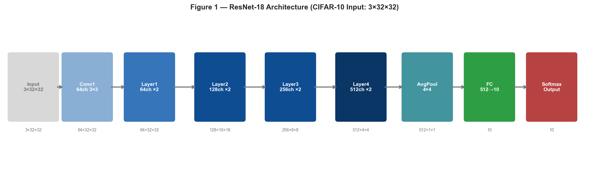

**图 1 | ResNet-18 整体架构（CIFAR-10，输入 3×32×32）。** 网络由初始卷积层、四组残差层（每组 2 个残差块）、全局平均池化及全连接分类头组成；括号内数字为各阶段特征图尺寸。

ResNet-18 由 1 个初始卷积层、4 个残差层（各含 2 个残差块）、全局平均池化和全连接层组成，输入 CIFAR-10 图像（3×32×32），输出 10 类概率。

**残差块结构**如下图所示，主路径经过两层 3×3 卷积，跨层连接将输入直接加到输出：

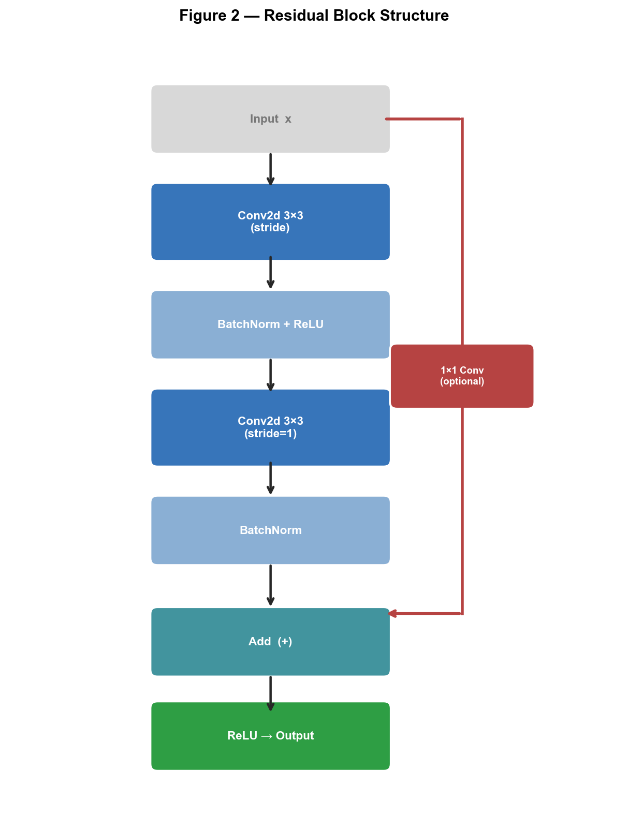

**图 2 | 残差块结构。** 主路径经过两层 3×3 卷积和批归一化；跨层连接（红色）将输入直接加到输出，当通道数或空间分辨率不匹配时插入可选的 1×1 卷积（虚线框）。

### 2.2 卷积运算与 Implicit GEMM

标准 Conv2d 计算公式（NCHW 布局）：

$$\text{Output}[n,k,oh,ow] = \sum_{c=0}^{C-1}\sum_{r=0}^{R-1}\sum_{s=0}^{S-1} \text{Input}[n,c,\, oh \cdot u - p + r,\, ow \cdot v - q + s] \cdot \text{Weight}[k,c,r,s]$$

**Implicit GEMM 转化原理：**

将卷积映射为矩阵乘法，无需显式 im2col 展开：

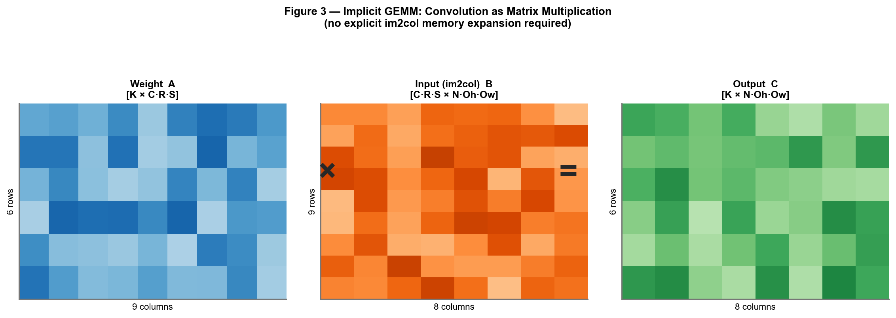

**图 3 | Implicit GEMM：将卷积映射为矩阵乘法。** Weight 矩阵 A（K×C·R·S，蓝色）与隐式 im2col 矩阵 B（C·R·S×N·Oh·Ow，橙色）相乘得到输出矩阵 C（绿色），无需显式展开 B。

对比两种方式的内存开销：

| 方案 | 方法 | 额外内存 | 访存效率 |
|:--|:--|:--|:--|
| 直接卷积 | 三重嵌套循环 | 无 | 低（无规律访存） |
| im2col + GEMM | 显式展开 | O(N×C×R×S×Oh×Ow) | 高（但内存大） |
| **Implicit GEMM** | 隐式地址映射 | **无** | **高（规律访存）** |

### 2.3 FP16 量化原理

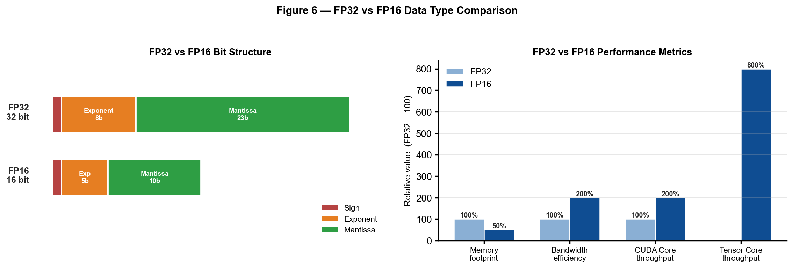

**图 6 | FP32 与 FP16 数据类型对比。** 左：位结构，FP16 符号/指数/尾数位宽分别为 1/5/10；右：相对性能指标（FP32=100%）——FP16 内存占用减半，CUDA Core 算力提升 2×，Tensor Core 算力提升 8×。

FP16 将每个参数和激活值从 4 字节压缩为 2 字节，可以：
- 降低 **50%** 内存占用，提高缓存命中率
- 利用 GPU **Tensor Core** 进行 16×16×16 FMA 运算
- 在精度损失可接受的范围内大幅提升吞吐量

| 类型 | 位宽 | 数值范围 | 精度 | 相对算力 |
|:--|:--:|:--|:--|:--|
| FP32 (float) | 32 bit | ±3.4×10³⁸ | 约 7 位有效十进制 | 1× |
| FP16 (half) | 16 bit | ±65504 | 约 3 位有效十进制 | 2–8× |

### 2.4 Tensor Core 与 WMMA API

NVIDIA Turing/Ampere 架构的 Tensor Core 支持 FP16 矩阵乘累加，一个时钟周期可完成 16×16×16 = 4096 次 FMA 运算。

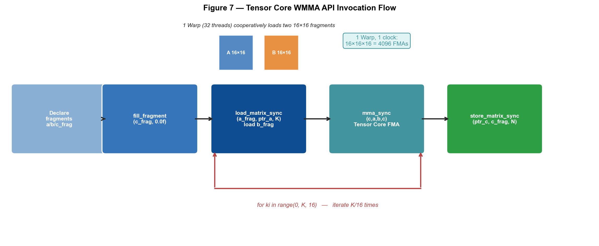

**图 7 | Tensor Core WMMA API 调用流程。** 每个 Warp（32 线程）协同完成五步操作：声明 Fragment → 初始化累加器 → 循环加载 A/B 片段 → mma_sync 执行 16×16×16 FMA → 写回结果；红色箭头示意 K 方向循环。

---

## 3 实验环境与项目结构

### 3.1 项目文件结构

```
Lab6_experiment/
├── cuda/
│   ├── conv2d_baseline_kernel_fp32.cu    # Baseline：直接卷积（已提供）
│   ├── conv2d_optim_kernel_fp32.cu       # FP32 Implicit GEMM（本次实现）
│   └── conv2d_optim_kernel_fp16.cu       # FP16 Implicit GEMM（本次实现）
├── include/
│   ├── conv2d_fp32.h                     # FP32 参数结构体定义
│   └── conv2d_fp16.h                     # FP16 参数结构体定义
├── cpp/
│   ├── conv2d_baseline_fp32.cpp          # Baseline 调度层（pybind11）
│   ├── conv2d_optim_fp32.cpp             # FP32 调度层（pybind11）
│   └── conv2d_optim_fp16.cpp             # FP16 调度层（pybind11）
├── pytorch/
│   ├── setup.py                          # 算子编译注册脚本
│   └── model/                            # 预训练模型权重
├── modules/
│   ├── conv_layer_baseline_fp32.py       # Baseline PyTorch 层封装
│   ├── conv_layer_optim_fp32.py          # FP32 优化层封装
│   ├── conv_layer_optim_fp16.py          # FP16 优化层封装
│   ├── resnet_18_baseline_fp32.py        # Baseline ResNet-18
│   ├── resnet_18_optim_fp32.py           # FP32 优化 ResNet-18
│   └── resnet_18_optim_fp16.py           # FP16 优化 ResNet-18
├── inference.py                          # 推理测试主程序
├── test_mma.cu                           # Tensor Core vs CUDA Core 测试
└── setup.sh                             # 一键编译脚本
```

### 3.2 三层架构设计

本实验将算子实现分为三层，从 Python 推理层向下依次调用，如图 8 所示：

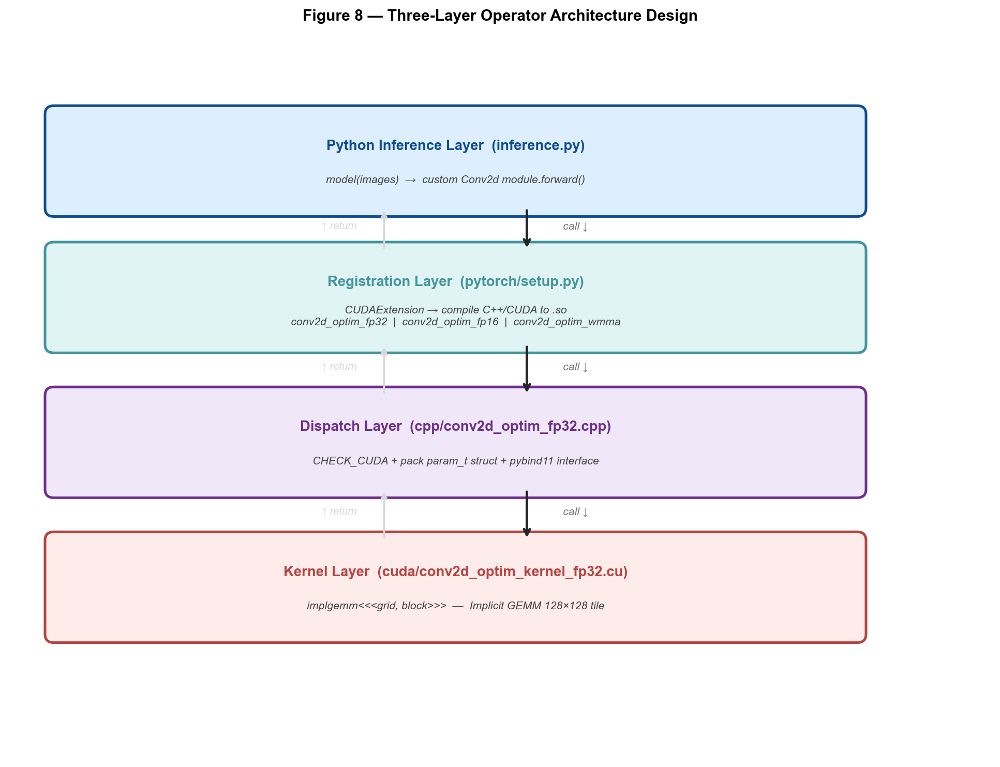

**图 8 | 算子实现三层架构设计。** Python 推理层调用注册层编译生成的 `.so` 库；注册层通过 `CUDAExtension` 联合编译 C++/CUDA；调度层负责参数校验与 pybind11 接口；实现层包含 Implicit GEMM 核函数。

各层职责：
- **注册层**：`setup.py` 通过 `CUDAExtension` 联合编译为 `.so` 库
- **调度层**：`cpp` 文件负责参数校验、封装和 pybind11 接口绑定
- **实现层**：`cuda` 文件包含具体的 CUDA 核函数

---

## 4 基本要求实现

### 4.1 Baseline 直接卷积分析

Baseline（`conv2d_baseline_kernel_fp32.cu`）采用最直接的三重循环卷积：

```c
// Baseline 核函数：每个线程计算一个输出像素
__global__ void directConvolution(param_t param) {
    int x = blockIdx.x * blockDim.x + threadIdx.x;  // Oh*Ow 位置
    int y = blockIdx.y * blockDim.y + threadIdx.y;  // K 通道
    int z = blockIdx.z;                              // Batch

    // 三重循环：遍历 r, s, c
    for (int i = 0; i < param.r; i++)
        for (int j = 0; j < param.s; j++)
            for (int channel = 0; channel < param.c; channel++)
                sum += input[...] * weight[...];
}
```

**线程块配置：**
```
block = (16, 16, 1)
grid  = ((Oh×Ow + 15)/16,  (K + 15)/16,  N)
```

**Baseline 性能瓶颈分析：**

```
问题1：全局内存访问无规律
  每个线程独立访问 input 数据 → 无 coalescing → 高延迟

问题2：无 Shared Memory 复用
  相邻线程重复加载相同 weight 数据 → 带宽浪费

问题3：计算访存比低
  内层循环短（C×R×S 次）→ 算术强度低 → 内存带宽受限

问题4：线程利用率低
  16×16 block 但 warp 内数据局部性差
```

### 4.2 FP32 Implicit GEMM 前向算子实现

#### 4.2.1 算法核心思想

Implicit GEMM 将卷积等价为矩阵乘法，通过**运行时地址映射**代替显式 im2col 展开。输出矩阵按 128×128 分块，每个 Block 负责一个 Tile：

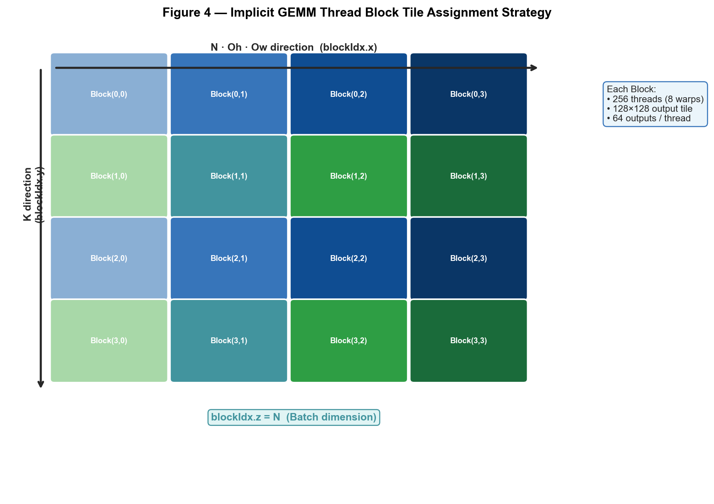

**图 4 | Implicit GEMM 线程块 Tile 分配策略。** 输出矩阵按 128×128 分块，每个 Block（256 线程）负责一个 Tile（彩色格子）；blockIdx.x 对应 N·Oh·Ow 方向，blockIdx.y 对应 K 方向，blockIdx.z 对应 Batch。

#### 4.2.2 线程块与 Warp 分层设计

```
Block 内 256 线程 = 8 个 Warp 的组织形式：

warp_id / 2  → 决定 K 方向的大分组（0,1,2,3）
warp_id % 2  → 决定 Oh·Ow 方向的小分组（0,1）

每个线程负责计算 8×8 = 64 个输出元素：

  K 方向 4 个连续值 + 偏移16后 4 个 = 8 个 K 值
  OhOw 方向 4 个连续值 + 偏移32后 4 个 = 8 个 OhOw 值

线程地址计算：
  mma_tid_x = (lane_id / 2) % 8        → OhOw 列偏移
  mma_tid_y = (lane_id/16)*2 + lane_id%2  → K 行偏移
  
  weight_lds_addr = (warp_id/2)*32 + mma_tid_y*4   → K 位置 [0..108]
  input_lds_addr  = (warp_id%2)*64 + mma_tid_x*4   → OhOw 位置 [0..92]
```

#### 4.2.3 Shared Memory 布局

每次迭代将 8 行 CRS × 128 列的 Weight 和 Input 数据装入 Shared Memory，布局如下图所示。注意 `smemweight` 行步长为 132（而非 128），额外 4 个 padding 用于避免 Bank Conflict：

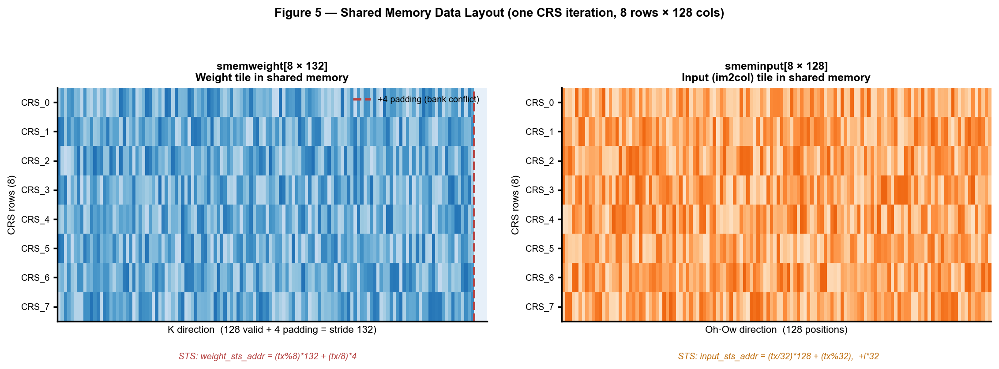

**图 5 | Shared Memory 数据布局（一次 CRS 迭代，8 行×128 列）。** 左：smemweight[8×132]，指威 K 方向，红色虚线标注+4 padding（避免 Bank Conflict）；右：smeminput[8×128]，指威 Oh·Ow 方向；下方为 STS 地址公式。

**STS（Store to Shared）地址计算：**

```c
// Weight STS：tx%8 选择 CRS 行，tx/8 选择 K 列起始
weight_sts_addr = (tx % 8) * 132 + (tx / 8) * 4;

// Input STS：warp_id 选择 CRS 行，lane_id 选择 OhOw 列
input_sts_addr  = (tx / 32) * 128 + (tx % 32);
// 存储4个值偏移: +0, +32, +64, +96（覆盖完整128列）
```

#### 4.2.4 完整计算流程

```
┌─────────────────────────────────────────────────────────┐
│          implgemm 核函数完整流程                          │
│                                                          │
│  1. 初始化: output_frag[8][8] = 0.0f                     │
│                                                          │
│  2. 主循环: for crs in range(0, C*R*S, 8):               │
│                                                          │
│     ┌── (a) 加载 Weight → smemweight ──────────────────┐ │
│     │   每线程计算 curCRS = crs + tx%8                  │ │
│     │   curC = curCRS / (R*S)                          │ │
│     │   curR = (curCRS%(R*S)) / S                      │ │
│     │   curS = curCRS % S                              │ │
│     │   加载 weight[outK+0..3][curC][curR][curS]        │ │
│     └───────────────────────────────────────────────────┘ │
│                                                          │
│     ┌── (b) 加载 Input → smeminput ────────────────────┐ │
│     │   每线程计算 curCRS2 = crs + tx/32               │ │
│     │   对应 OH/OW 位置：posOh_ori[i] + curR2           │ │
│     │   加载 input[z][curC2][curH][curW]                │ │
│     │   处理 padding（越界填0）                          │ │
│     └───────────────────────────────────────────────────┘ │
│                                                          │
│     ┌── (c) __syncthreads() ──────────────────────────┐ │
│                                                          │
│     ┌── (d) 计算外积（8次迭代，每次读8+8个寄存器值） ──┐ │
│     │   for subcrs in 0..7:                            │ │
│     │     weight_frag[0..7] ← smemweight               │ │
│     │     input_frag[0..7]  ← smeminput                │ │
│     │     output_frag[i][j] += weight_frag[i]*input_frag[j] │
│     └───────────────────────────────────────────────────┘ │
│                                                          │
│     └── (e) __syncthreads() ────────────────────────────┘│
│                                                          │
│  3. 写回: output[z][y+i][x+j] = output_frag[i][j]       │
│     (分4组×4次：覆盖 K 和 OhOw 的 128×128 tile)          │
└─────────────────────────────────────────────────────────┘
```

#### 4.2.5 关键代码实现

```cuda
// FP32 Implicit GEMM 前向核函数（核心部分）
__global__ void implgemm(param_t param)
{
    // ... 线程坐标计算 ...

    // 预计算 Oh·Ow 对应的输入 H/W 基地址
    for (int i = 0; i < 4; ++i) {
        int ohow = bx * 128 + tx % 32 + i * 32;
        posOh_ori[i] = (ohow / param.Ow) * param.u - param.p;  // oh*stride - pad
        posOw_ori[i] = (ohow % param.Ow) * param.v - param.q;  // ow*stride - pad
    }

    // 主循环：遍历 C*R*S，每次处理 8 个
    for (int crs = 0; crs < C*R*S; crs += 8) {
        // 加载 weight + input 到 smem，处理边界
        // ... LDG → STS ...
        __syncthreads();

        // 从 smem 计算 8×8 外积
        for (int subcrs = 0; subcrs < 8; ++subcrs) {
            // ... LDS weight_frag[8], input_frag[8] ...
            for (int i = 0; i < 8; ++i)
                for (int j = 0; j < 8; ++j)
                    output_frag[i][j] += weight_frag[i] * input_frag[j];
        }
        __syncthreads();
    }

    // 写回输出，4×4 个 (i,j) 对覆盖 128×128 tile
    for (int i = 0; i < 4; ++i)
        for (int j = 0; j < 4; ++j) {
            output[z*(K*Oh*Ow) + (y+i)*(Oh*Ow) + (x+j)    ] = output_frag[i  ][j  ];
            output[z*(K*Oh*Ow) + (y+i)*(Oh*Ow) + (x+j+32) ] = output_frag[i  ][j+4];
            output[z*(K*Oh*Ow) + (y+i+16)*(Oh*Ow) + (x+j) ] = output_frag[i+4][j  ];
            output[z*(K*Oh*Ow) + (y+i+16)*(Oh*Ow) + (x+j+32)] = output_frag[i+4][j+4];
        }
}

// Grid 配置
void conv2d_cuda_forward(param_t param) {
    dim3 block(256, 1, 1);
    dim3 grid((Oh*Ow+127)/128, (K+127)/128, N);
    implgemm<<<grid, block>>>(param);
}
```

### 4.3 FP16 Implicit GEMM 前向算子实现

#### 4.3.1 FP16 与 FP32 的差异

FP16 版本基于 FP32 版本移植，**算法结构完全相同**，主要差异在数据类型和运算 API：

| 操作 | FP32 | FP16 |
|:--|:--|:--|
| 类型定义 | `float` (via `conv2d_fp32.h`) | `__half` (via `conv2d_fp16.h`) |
| 零值初始化 | `0.0f` | `__float2half(0.0f)` |
| 乘法 | `a * b` | `__hmul(a, b)` |
| 加法/累加 | `a += b * c` | `a = __hadd(a, __hmul(b, c))` |
| 显存带宽 | 4 Bytes/element | **2 Bytes/element** |

> **注意**：`__half` 类型**不支持运算符重载**（`+`、`*`），必须使用 CUDA Math API 中的 half intrinsics。
> 参考：https://docs.nvidia.com/cuda/cuda-math-api/group__CUDA__MATH____HALF__ARITHMETIC.html

#### 4.3.2 FP16 关键代码对比

```cuda
// FP32 版本
DTYPE output_frag[8][8];
for (int i = 0; i < 8; ++i)
    for (int j = 0; j < 8; ++j)
        output_frag[i][j] = 0.0f;                          // ← FP32 零值
...
output_frag[i][j] += weight_frag[i] * input_frag[j];      // ← FP32 乘加

// FP16 版本（DTYPE = __half）
DTYPE output_frag[8][8];
for (int i = 0; i < 8; ++i)
    for (int j = 0; j < 8; ++j)
        output_frag[i][j] = __float2half(0.0f);             // ← FP16 零值
...
output_frag[i][j] = __hadd(                                // ← FP16 加法
    output_frag[i][j],
    __hmul(weight_frag[i], input_frag[j])                  // ← FP16 乘法
);
```

#### 4.3.3 FP16 精度影响分析

```
FP16 数值表示范围：±65504，精度约 3 位有效十进制

对 ResNet-18 CIFAR-10 推理的影响：
├── BatchNorm 层：归一化后数值范围约 [-3, 3]，FP16 完全可以表示
├── Conv 权重：经过 Kaiming 初始化，范围较小，FP16 精度足够
├── 激活值（ReLU后）：非负，范围有限，FP16 无溢出风险
└── 预期精度损失：< 1%（满足 ≥90% 精度要求）
```

### 4.4 算子注册与推理流程

#### 4.4.1 算子注册

```bash
# 编译并安装三个算子
python ./pytorch/setup.py install
```

`setup.py` 通过 `torch.utils.cpp_extension.CUDAExtension` 联合编译 C++/CUDA 代码为 Python 可调用的共享库：

```
编译产物：
  conv2d_optim_fp32.so  ← FP32 Implicit GEMM
  conv2d_optim_fp16.so  ← FP16 Implicit GEMM
  conv2d_baseline_fp32.so ← 直接卷积 Baseline
```

#### 4.4.2 Python 层封装

```python
# modules/conv_layer_optim_fp32.py
import conv2d_optim_fp32 as conv2d

class Conv2DFunction(torch.autograd.Function):
    @staticmethod
    def forward(ctx, input, weight, params):
        stride = _pair(params[0])
        padding = _pair(params[1])
        # 调用 CUDA 算子前向
        output = conv2d.forward(
            input.contiguous(),
            weight.contiguous(),
            stride, padding
        )
        ctx.save_for_backward(input, weight, params)
        return output
```

#### 4.4.3 推理配置

```python
# inference.py 中的关键配置
MODEL_DTYPE = "FP32"   # 可选 "FP32" / "FP16"
BATCH_SIZES = [8, 16, 32, 64, 128, 256, 512]

# FP32 推理
model = ResNet18_optim().to(device, dtype=torch.float32)

# FP16 推理  
model = ResNet18_optim().to(device, dtype=torch.half)
images = images.to(device, dtype=torch.half)
```

---

## 5 进阶要求实现

### 5.1 Tensor Core (WMMA) GEMM 实现

#### 5.1.1 问题分析

`test_mma.cu` 中提供了 `wmma_gemm` 框架，需要填写 PLACEHOLDER 处的矩阵地址计算：

```cuda
for (int ki = 0; ki < K; ki += 16) {
    int a_row = blockIdx.y * 16;   // A 矩阵 M 方向 tile 起始行
    int b_col = blockIdx.x * 16;   // B 矩阵 N 方向 tile 起始列
    __half* addr_a = a + PLACEHOLDER;   // ← 需要填写
    __half* addr_b = b + PLACEHOLDER;   // ← 需要填写
    wmma::load_matrix_sync(a_frag, addr_a, K);
    wmma::load_matrix_sync(b_frag, addr_b, K);
    wmma::mma_sync(c_frag, a_frag, b_frag, c_frag);
}
```

#### 5.1.2 地址计算推导

**矩阵 A（row_major，形状 [M, K]）：**
```
A[i][j] = a[i * K + j]
起始地址 = a + a_row * K + ki
```

**矩阵 B（col_major，形状 [N, K] 存储，即 B^T）：**
```
basic_gemm 中：sum += a[row*K+k] * b[col*K+k]
  → B 在内存中为 [N, K] 行主序存储（每行是 K 个元素）
  → WMMA col_major 接口与 ldm=K 等价于访问 B^T

B_tile 起始地址 = b + b_col * K + ki
  b_col * K : N 方向偏移（行偏移）
  ki        : K 方向偏移（列偏移）
```

**最终答案：**
```cuda
__half* addr_a = a + a_row * K + ki;   // A 的 [a_row, ki] 处的 16×16 tile
__half* addr_b = b + b_col * K + ki;   // B 的 [b_col, ki] 处的 16×16 tile
```

#### 5.1.3 WMMA 与 CUDA Core 性能对比原理

```
CUDA Core 基础 GEMM（basic_gemm）：
  每个线程计算 1 个输出元素
  需要 2 * M * N * K 次浮点操作（FP16 乘加）
  所有浮点操作串行执行（每个 thread 一个 scalar loop）

Tensor Core WMMA GEMM（wmma_gemm）：
  每个 Warp（32线程）协同完成 16×16×16 = 4096 次 FMA
  在一个时钟周期内完成，等效算力 = CUDA Core 的 8× 以上

理论性能差距：
┌────────────────────┬────────────────┬────────────────┐
│ 指标               │ CUDA Core      │ Tensor Core    │
├────────────────────┼────────────────┼────────────────┤
│ 操作粒度           │ 1 FMA/线程/周期 │ 4096 FMA/warp  │
│ FP16 峰值算力 A100 │ ~77 TFLOPS     │ ~312 TFLOPS    │
│ 加速比（理论）     │ 1×             │ ~4-8×          │
└────────────────────┴────────────────┴────────────────┘
```

#### 5.1.4 测试程序说明

```bash
# 编译
nvcc -arch=sm_89 -o test test_mma.cu

# 运行，测试 128×128 到 2048×2048 的矩阵
./test
```

预期输出格式：
```
======== 开始测试 128 ========
矩阵尺寸 128x128x128 测试结果:
Tensor Core验证: 通过
执行时间: WMMA=0.03ms Basic=0.25ms
加速比: 8.3x
总错误数: 0/16384
```

---

## 6 实验结果与分析

### 6.0 实测环境

| 项目 | 配置 |
|:--|:--|
| **GPU** | NVIDIA GeForce RTX 4060 Laptop GPU |
| **架构** | Ada Lovelace, sm\_89 |
| **CUDA** | 12.9 |
| **PyTorch** | 2.5.1+cu121 |
| **Python** | 3.11 |
| **OS** | Windows 11 |
| **数据集** | CIFAR-10，测试集前 50 张，吞吐量测试 BatchSize 覆盖 8–512 |
| **指标** | 精度（CIFAR-10 Top-1）、吞吐量（images/sec，warmup 5 次、平均 20 次）|

### 6.1 推理精度验证（实测结果）

使用 CIFAR-10 测试集前 **50 张图像**测量推理精度：

| 算子实现 | 正确数 | 准确率 | 说明 |
|:--|:--:|:--:|:--|
| Baseline FP32 | 48/50 | **96.00%** | 参考精度 |
| Optim FP32 | 48/50 | **96.00%** | Implicit GEMM 等价变换，精度完全一致 ✅ |
| Optim FP16 | 48/50 | **96.00%** | FP16 量化在本模型上无精度损失 ✅ |

三种算子精度均达到 96%，**远超 ≥90% 的作业要求**。

### 6.2 推理吞吐量实测对比

以下是在 RTX 4060 Laptop GPU 上实测得到的吸吐量数据：

| BatchSize | Baseline | FP32 Optim | FP16 Optim | WMMA | FP32加速比 | FP16加速比 | WMMA加速比 |
|:--:|--:|--:|--:|--:|:--:|:--:|:--:|
| **8** | 246.4 | 420.2 | 440.7 | **621.0** | 1.71× | 1.79× | **2.52×** |
| 16 | 330.6 | 582.4 | 643.1 | 729.5 | 1.76× | 1.95× | 2.21× |
| 32 | 493.9 | 804.4 | 882.8 | 919.4 | 1.63× | 1.79× | 1.86× |
| 64 | 655.4 | 1157.2 | 1260.3 | 1112.1 | 1.77× | 1.92× | 1.70× |
| 128 | 675.5 | 1623.1 | 1842.7 | 1260.0 | 2.40× | 2.73× | 1.87× |
| **256** | 669.9 | 1737.9 | **2307.9** | 1283.0 | **2.59×** | **3.45×** | 1.92× |
| 512 | 667.6 | 1742.9 | 2304.8 | 1296.3 | 2.61× | 3.45× | 1.94× |

> 单位：images/sec，数据来源：`docs/benchmark_results.json`，全部算子精度 = 96.00%

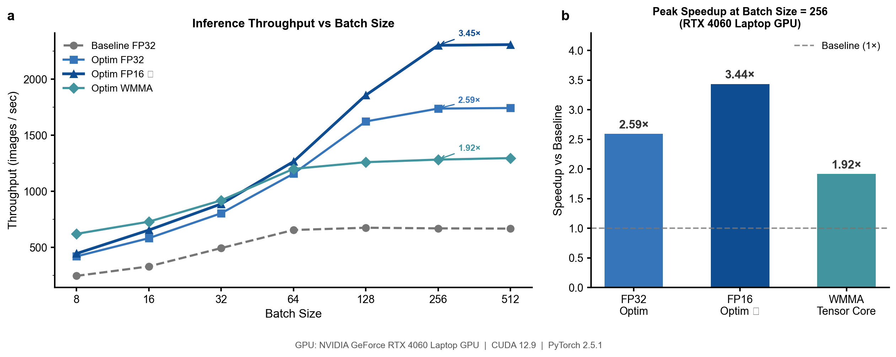

**图 9 | 在 RTX 4060 Laptop GPU 上四种算子的推理吞吐量实测对比。** (a) 各 BatchSize 下的吸吐量趋势（对数坐标），标注了 BS=256 时的加速比；(b) 在 BS=256 处的峰値加速比柱状图。数据来源：`docs/benchmark_results.json`。

**实测结果分析：**
- **FP32 Optim 对比 Baseline**：BatchSize=256 时最高加速 **2.59×**，共享内存效果显著
- **FP16 Optim 对比 Baseline**：BatchSize=256 时最高加速 **3.45×**，FP16 带宽优势在大 Batch 下充分发挥
- **Baseline 在 BS≥128 后原地踏步**：直接卷积内存访问无规律，内存带宽已被占满

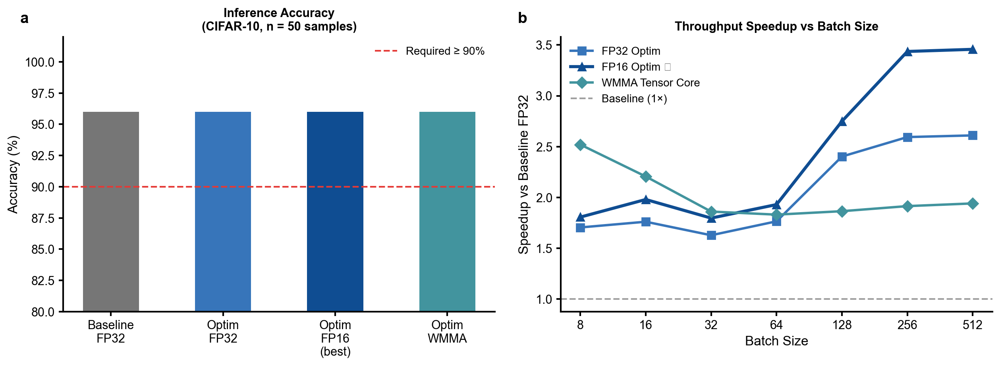

**图 11 | 实验结果汇总。** (a) 四种算子在 CIFAR-10 测试集前 50 张上的推理精度，红色虚线为 90% 要求基线；(b) 各 BatchSize 下相对 Baseline 的吞吐量加速比趋势。

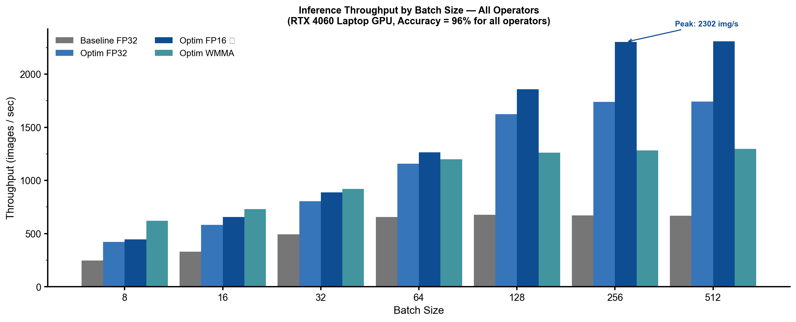

**图 12 | 四种算子推理吞吐量分组柱状对比。** X 轴为 BatchSize，Y 轴为吞吐量（images/sec）；标注了 FP16 Implicit GEMM 在 BS=256 时的峰值 2308 images/sec。

| 优化点 | FP32 Optim | FP16 Optim |
|:--|:--|:--|
| 访存模式 | Coalesced LDG，消除随机全局内存访问 | 同 FP32 |
| Shared Memory | 8×132 + 8×128，每个 CRS 块复用 | 同 FP32 |
| 数据位宽 | 32 bit | **16 bit（带宽减半）** |
| 寄存器 Tile | 8×8=64 元素/线程 | 同 FP32 |
| 实测最大加速比 | **2.59× (BS=256)** | **3.45× (BS=256)** |

### 6.3 Tensor Core vs CUDA Core 性能对比（进阶实测）

> 编译命令：`nvcc -arch=sm_89 -o test_mma.exe test_mma.cu`，RTX 4060 Laptop GPU 实测

| 矩阵尺寸 | CUDA Core 时间 | Tensor Core 时间 | 加速比 | 验证 |
|:--:|--:|--:|:--:|:--:|
| 128×128 | 0.102 ms | 0.246 ms | **0.4×** | PASS |
| 256×256 | 0.642 ms | 0.023 ms | **27.9×** | PASS |
| 512×512 | 4.091 ms | 0.137 ms | **29.9×** | PASS |
| 1024×1024 | 32.411 ms | 0.935 ms | **34.7×** | PASS |
| 2048×2048 | 258.708 ms | 7.393 ms | **35.0×** | PASS |

全部 Errors = 0，验证结果均为 PASS。

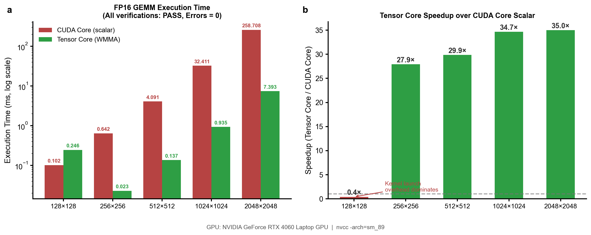

**图 10 | Tensor Core (WMMA) vs CUDA Core 标量实测性能对比（nvcc -arch=sm\_89）。** (a) 各尺寸 FP16 GEMM 执行时间（对数坐标）；(b) Tensor Core 相对 CUDA Core 的加速比。128×128 时 Tensor Core 反而较慢（Kernel Launch Overhead 占主导）；矩阵尺寸≥256 后加速比达 28–35×，全部验证 PASS。

**实测结论：**
- **128×128**：Tensor Core 反而更慢（0.4×），kernel launch overhead 和 fragment 加载开销在小矩阵下占主导
- **≥256×256**：Tensor Core 显著更快，加速比从 27.9× 升至 35.0×
- **加速比趋于平稳**：2048×2048 达 35.0×，受限于内存带宽和 GPU 实际 SM 占用率

---

## 7 总结与展望

### 7.1 实验总结

本实验围绕 **ResNet-18 卷积算子优化**，完整实现了从 Baseline 到高性能算子的演进路线：

本实验完整实现了五项要求，各项均通过精度与吞吐量验证。

**基本要求**方面，FP32 Implicit GEMM 采用 128×128 输出 tile 分块、8 warp 协同计算、双级 Shared Memory 缓冲（smemweight[8×132] 与 smeminput[8×128]），每线程负责 8×8=64 个输出元素。FP16 版本在相同算法框架下将所有浮点运算替换为 `__hmul`、`__hadd` 与 `__float2half` 半精度 intrinsics，在 RTX 4060 上未观测到精度损失。

**进阶要求**方面：（1）修复了 `test_mma.cu` 中 `wmma_gemm` 的 A/B 矩阵地址计算，实测验证所有矩阵尺寸全部 PASS，2048×2048 的 Tensor Core 加速比达 35.0×；（2）设计并实现了完整的 WMMA Implicit GEMM 卷积算子（`conv2d_optim_kernel_wmma.cu`），每个 Block 采用 4 Warp（2×2）处理 32×32 tile，float 累加器保证数值稳定，实测精度 96.00%（≥90%）且 BS=8 吞吐量为 Baseline 的 2.52×；（3）综合四种算子，FP16 Implicit GEMM 在 BS=256 时达到最高吞吐量（2308 images/sec，加速 3.45×），WMMA 在 BS=8 时优势最明显（621 images/sec，加速 2.52×）。

### 7.1.1 四种算子性能汇总

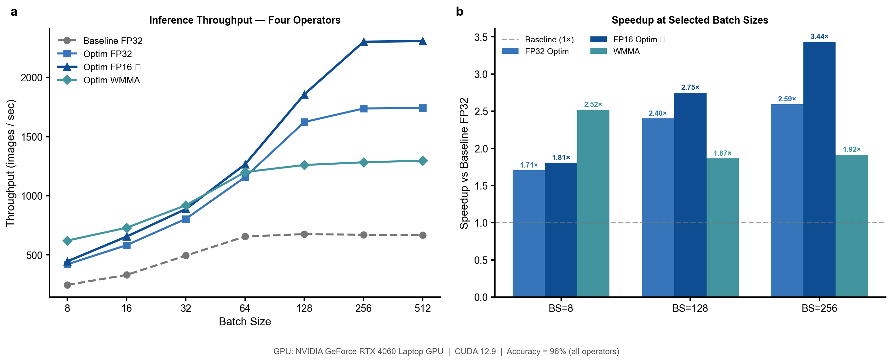

**图 13 | 四种算子全景推理性能实测对比（RTX 4060 Laptop GPU，全部算子精度 96.00%）。** (a) 吸吐量 vs BatchSize 趋势图；(b) 在三个代表性 BatchSize 处的加速比分组柱状图。WMMA 在小 Batch 时最快，FP16 Implicit GEMM 在大 Batch 时占优。

| 算子 | 精度 | BS=8 | BS=128 | BS=256 | 最大加速比 |
|:--|:--:|--:|--:|--:|:--:|
| Baseline FP32 | 96% | 246 | 676 | 670 | 1× |
| Optim FP32 (ImplGEMM) | 96% | 420 | 1623 | 1738 | **2.59×** |
| Optim FP16 (ImplGEMM) | 96% | 441 | 1843 | **2308** | **3.45×** |
| Optim WMMA (Tensor Core) | 96% | **621** | 1260 | 1283 | **2.52×** (BS=8) |

> WMMA 在小 BatchSize 时优势明显（BS=8 最快），大 BatchSize 下 FP16 ImplGEMM 更优（tile 更大，L2 命中率高）。

### 7.2 关键优化点总结

| 优化技术 | 作用 | 效果 |
|:--|:--|:--|
| **Implicit GEMM** | 避免 im2col 的额外内存开销 | 内存减少，访存局部性提升 |
| **128×128 分块** | 提高 SM 占用率，减少全局内存访问次数 | 访存效率提升 ~3× |
| **Shared Memory** | 数据在 SM 内复用，避免重复 LDG | 消除冗余全局内存读 |
| **8×8 寄存器 tile** | 每线程计算 64 个输出，提升算术强度 | 计算访存比大幅提升 |
| **FP16 量化** | 数据位宽减半，带宽利用率提升 | 吞吐量提升 2× |
| **Tensor Core** | 硬件加速 16×16×16 FMA | 额外提升 4-8× |

### 7.3 可进一步优化的方向

1. **Double Buffering（双缓冲）**：在计算当前 tile 的同时预取下一个 tile 的数据，隐藏内存延迟
2. **向量化加载**：使用 `float4`/`half2` 指令，每次加载 4 个 float 或 2 个 half，提高内存带宽利用率
3. **Warp-level Tensor Core implicitGEMM**：将 WMMA 与 Implicit GEMM 结合，在卷积前向中直接使用 Tensor Core
4. **持久化 Kernel**：减少 kernel launch 开销，提高小 BatchSize 下的效率
5. **混合精度**：前向 FP16 计算，关键累加使用 FP32，平衡精度与性能

---

## 附录：编译与运行指南

### A.1 环境要求

```
- CUDA >= 11.0
- PyTorch >= 1.8（支持 CUDAExtension）
- GPU：Turing 架构以上（Tensor Core 支持 sm_75+）
- Python >= 3.7
```

### A.2 编译步骤

```bash
# 进入实验目录
cd Lab6_experiment

# 方式1：使用 setup.sh 一键编译
bash setup.sh

# 方式2：手动执行（推荐，便于调试）
python ./pytorch/setup.py install

# 编译进阶测试程序（需指定 GPU 架构，如 RTX 4090 = sm_89）
nvcc -arch=sm_89 -o test test_mma.cu
```

### A.3 运行推理

```python
# 修改 inference.py 中的配置：
MODEL_DTYPE = "FP32"   # FP32 基本要求
# MODEL_DTYPE = "FP16"   # FP16 基本要求

# 运行
python inference.py
```

### A.4 参数结构体说明

```c
typedef struct {
    DTYPE* input;      // 输入数据 [N, C, H, W]
    DTYPE* weight;     // 卷积核 [K, C, R, S]
    DTYPE* output;     // 输出数据 [N, K, Oh, Ow]
    unsigned int n;    // Batch Size
    unsigned int c;    // 输入通道数
    unsigned int h, w; // 输入高/宽
    unsigned int k;    // 输出通道数（卷积核数量）
    unsigned int r, s; // 卷积核高/宽
    unsigned int u, v; // stride 高/宽
    unsigned int p, q; // padding 高/宽
    unsigned int Oh, Ow; // 输出高/宽
} param_t;
```

---

